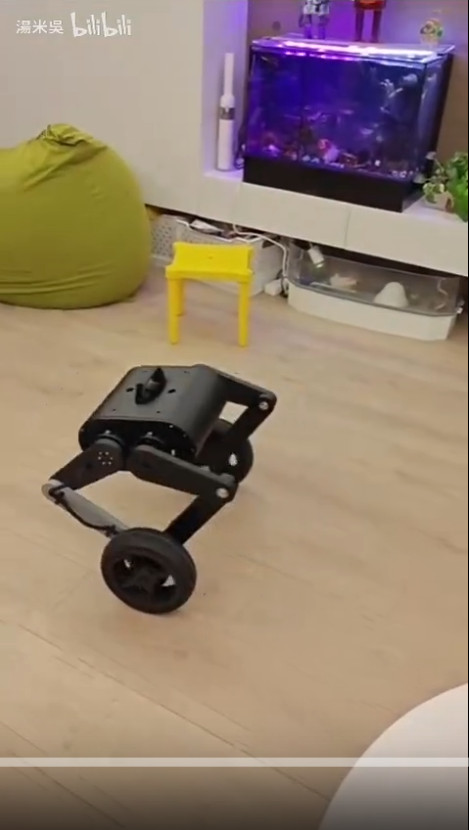

# 輪足機器人導航系統 - 一鍵啟動 - 立即開始

本指南將幫助您在5分鐘內完成所有配置並開始使用！

## 🎥 視頻展示

**【ROS2輪足機器人展示】**

<div align="center">
  <a href="https://www.bilibili.com/video/BV1ZdveB1E4g/?share_source=copy_web&vd_source=6ce322261c8d85454a0bce5d83c69113">
    
  </a>
  <p><i>點擊圖片觀看完整視頻演示</i></p>
</div>

👉 **觀看視頻**: [https://www.bilibili.com/video/BV1ZdveB1E4g/](https://www.bilibili.com/video/BV1ZdveB1E4g/?share_source=copy_web&vd_source=6ce322261c8d85454a0bce5d83c69113)

## 💻 硬件平台

- **上位機**: NVIDIA Jetson Orin NX 16GB
- **操作系統**: Ubuntu 22.04 (推薦)
- **ROS版本**: ROS2 Humble

---

## 📑 目錄

- [第一部分：建圖系統](#第一部分建圖系統) - 使用 SLAM 建立環境地圖
- [第二部分：導航系統](#第二部分導航系統) - 一鍵啟動自主導航

---

# 第一部分：建圖系統

## ✅ 使用 URDF 中的 Lidar 位置開始建圖

---

## 🚀 快速開始（3步完成）

### 步驟 1-1：編譯兩個包

```bash
cd ~/legged_robot/ROS2_Packages

# 編譯 URDF 包和控制包
colcon build --packages-select wheel_legged_urdf_pkg wheeled_legged_pkg

source install/setup.bash
```

### 步驟 1-2：啟動建圖系統（一鍵啟動！）

```bash
# 只需一個終端即可啟動所有節點
ros2 launch wheeled_legged_pkg mapping_with_lidar.launch.py
```

✅ **現在會自動啟動**：
- `wl_base_node` (機器人節點)
- `robot_state_publisher` (URDF)
- N10 Lidar 驅動
- SLAM Toolbox

⚠️ **如果需要分開啟動（調試用）**：
```bash
# 終端1：
ros2 run wheeled_legged_pkg wl_base_node

# 終端2：
ros2 launch wheeled_legged_pkg mapping_with_lidar.launch.py
# （注意：需要註釋掉 launch 檔案中的 wl_base_node）
```

### 步驟 1-3：驗證 TF

```bash
# 終端3（可選）：驗證 TF 變換
ros2 run tf2_ros tf2_echo base_link laser
```

**應該顯示**：
```
Translation: [0.045, -0.001, 0.104]
```

---

## 📐 URDF 中的 Lidar 配置

**檔案位置**：
```
wheel_legged_urdf_pkg/urdf/wheel_legged_urdf_pkg.urdf
```

**Lidar 位置（相對 base_link）**：
```
┌──────────────────────────┐
│  X =  0.0451m (前方)     │
│  Y = -0.0007m (中心)     │
│  Z =  0.1038m (向上)     │
└──────────────────────────┘
```

---

## 🏗️ 系統架構

**現在的 TF 變換鏈**：

```
map (SLAM發佈)
 │
 └─ odom (wl_base_node發佈)
     │
     └─ base_link (wl_base_node發佈)
         │
         ├─ laser (robot_state_publisher從URDF讀取) ✓
         ├─ imu_link (robot_state_publisher從URDF讀取)
         └─ ... (所有其他關節)
```

---

## ✨ 主要優勢

- ✅ **自動化**：無需手動配置靜態 TF
- ✅ **準確性**：使用 URDF 中精確定義的位置
- ✅ **完整性**：包含所有機器人部件的 TF
- ✅ **可維護**：統一在 URDF 檔案中管理
- ✅ **可視化**：在 RViz 中可以看到完整機器人模型

---

## 👁️ RViz 可視化（可選）

```bash
rviz2
```

**配置**：
1. **Fixed Frame**: `map`
2. **Add → RobotModel**
   - 可以看到完整的機器人 3D 模型！
3. **Add → TF**
   - 顯示所有座標系
4. **Add → LaserScan** (Topic: `/scan`)
5. **Add → Map** (Topic: `/map`)

---

## 📦 依賴確認

如果遇到問題，確保安裝了：

```bash
sudo apt install -y \
  ros-humble-robot-state-publisher \
  ros-humble-slam-toolbox \
  ros-humble-nav2-map-server \
  ros-humble-tf2-tools
```

---

## 🔧 如何修改 Lidar 位置

如果需要調整：

**1. 編輯 URDF**：
```bash
nano ~/legged_robot/ROS2_Packages/src/wheel_legged_urdf_pkg/urdf/wheel_legged_urdf_pkg.urdf
```

找到：`<joint name="lidar_joint_link">`  
修改：`<origin xyz="X Y Z" />`

**2. 重新編譯**：
```bash
colcon build --packages-select wheel_legged_urdf_pkg
source install/setup.bash
```

**3. 重啟系統**

---

## ✔️ 驗證檢查清單

啟動後檢查以下內容：

- [ ] `robot_state_publisher` 正在運行
  ```bash
  ros2 node list | grep robot_state_publisher
  ```

- [ ] `base_link` → `laser` TF 存在
  ```bash
  ros2 run tf2_ros tf2_echo base_link laser
  ```

- [ ] Lidar 資料正常
  ```bash
  ros2 topic hz /scan
  ```

- [ ] 裡程計資料正常
  ```bash
  ros2 topic hz /odom
  ```

- [ ] TF 樹完整
  ```bash
  ros2 run tf2_tools view_frames
  ```

---

## 🗺️ 開始建圖！

現在一切就緒！按照上面的「快速開始」步驟啟動系統，然後慢慢移動機器人開始建圖。

### 建圖技巧

- 🐢 速度保持在 **0.3 m/s** 以內
- 🔄 平滑轉向，避免急轉
- 🔁 多次經過相同區域
- 🏠 確保環境有足夠特徵（牆壁、家具等）

### 保存地圖

```bash
ros2 run nav2_map_server map_saver_cli -f ~/maps/my_map
```

這將生成兩個檔案：
- `my_map.pgm` - 地圖圖像
- `my_map.yaml` - 地圖配置

---

## ❓ 建圖常見問題

### 問題：找不到 wheel_legged_urdf_pkg
```bash
colcon build --packages-select wheel_legged_urdf_pkg
```

### 問題：robot_state_publisher 啟動失敗
```bash
sudo apt install ros-humble-robot-state-publisher
```

### 問題：TF 變換不顯示
- 檢查兩個包是否都編譯成功
- `ros2 node list` 確認 robot_state_publisher 在運行

### 問題：建圖效果不好
- 放慢移動速度
- 增加環境特徵
- 確保 Lidar 資料穩定

---

**✅ 建圖完成！現在可以進入第二部分：導航系統**

---

# 第二部分：導航系統

## 步驟2-1：編譯系統 （2分鐘 , Note I'm using Jetson Orin NX 16G）

```bash
cd ~/legged_robot/ROS2_Packages
colcon build --packages-select wheeled_legged_pkg --symlink-install
source install/setup.bash
```

---

## 步驟2-2：添加執行權限（30秒）

```bash
chmod +x ~/legged_robot/ROS2_Packages/wheeled_legged_pkg/scripts/start_full_navigation.sh
chmod +x ~/legged_robot/ROS2_Packages/wheeled_legged_pkg/scripts/auto_init_amcl.py
```

---

## 步驟2-3：一鍵啟動導航！（30秒）

```bash
~/legged_robot/ROS2_Packages/wheeled_legged_pkg/scripts/start_full_navigation.sh
```

系統會自動：
- ✅ 檢查串口權限
- ✅ 啟動機器人基礎節點（自動選擇 /dev/ttyACM0）
- ✅ 啟動激光雷達
- ✅ 啟動導航系統（包含 RViz）
- ✅ 等待15秒後自動初始化 AMCL

---

## 步驟2-4：在 RViz 中導航（1分鐘）

等待自動初始化完成（約15秒），然後：

1. 在 RViz 中，將 Fixed Frame 切換到 "map"
2. (可選) 使用 "2D Pose Estimate" 微調機器人位置
3. 使用 "2D Goal Pose" 設置導航目標
4. 觀察機器人自動導航！

---

## 管理 tmux 會話

### 查看會話
```bash
tmux attach -t nav_system
```

### 切換窗口
按 `Ctrl+B` 然後按數字鍵 (0,1,2,3)
- 0 = robot_base (機器人基礎)
- 1 = lidar (激光雷達)
- 2 = navigation (導航系統)
- 3 = auto_init (自動初始化)

### 退出查看
按 `Ctrl+B` 然後按 `D`

### 關閉系統
```bash
tmux kill-session -t nav_system
```

---

## 常見問題快速修復

### 問題：串口權限不足

**臨時解決：**
```bash
sudo chmod 666 /dev/ttyACM0
```

**永久解決：**
```bash
~/legged_robot/ROS2_Packages/wheeled_legged_pkg/scripts/setup_serial_permissions.sh
```

### 問題：激光雷達未啟動

**檢查：**
```bash
ros2 topic hz /scan
```

**手動啟動：**
```bash
cd ~/legged_robot/LSLIDAR_X_ROS2/src
source install/setup.bash
ros2 launch lslidar_driver lsn10_launch.py
```

### 問題：AMCL 未初始化

**檢查：**
```bash
ros2 lifecycle get /amcl
```

**手動初始化：**
```bash
ros2 topic pub --once /initialpose geometry_msgs/msg/PoseWithCovarianceStamped '{header: {frame_id: "map"}, pose: {pose: {position: {x: 0.0, y: 0.0, z: 0.0}, orientation: {x: 0.0, y: 0.0, z: 0.0, w: 1.0}}, covariance: [0.25, 0.0, 0.0, 0.0, 0.0, 0.0, 0.0, 0.25, 0.0, 0.0, 0.0, 0.0, 0.0, 0.0, 0.0, 0.0, 0.0, 0.0, 0.0, 0.0, 0.0, 0.0, 0.0, 0.0, 0.0, 0.0, 0.0, 0.0, 0.0, 0.0, 0.0, 0.0, 0.0, 0.0, 0.0, 0.06853892326654787]}}'
```

---

## 系統狀態檢查

### 檢查所有節點
```bash
ros2 node list
```

### 檢查激光雷達
```bash
ros2 topic hz /scan
```

### 檢查里程計
```bash
ros2 topic hz /odom
```

### 檢查 AMCL 狀態
```bash
ros2 lifecycle get /amcl
```

### 檢查 TF 樹
```bash
ros2 run tf2_ros view_frames
```

---

## 就這麼簡單！

現在運行：

```bash
~/legged_robot/ROS2_Packages/wheeled_legged_pkg/scripts/start_full_navigation.sh
```

享受自動化的導航體驗！🚀


